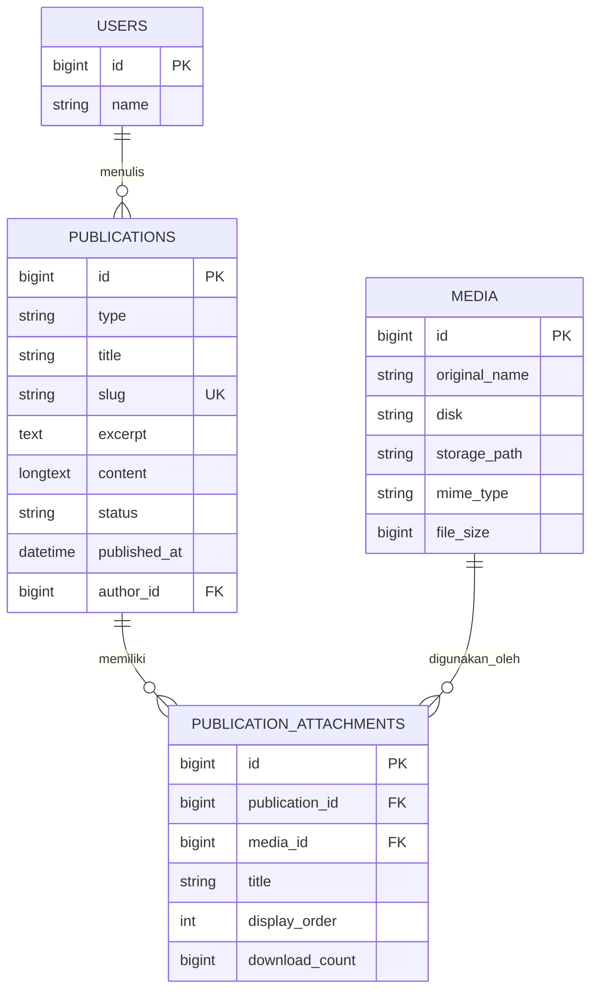
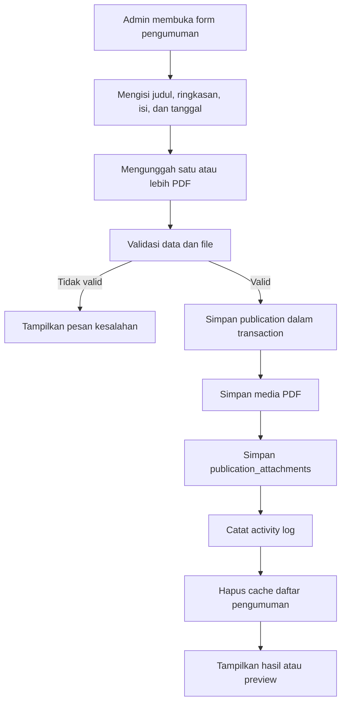
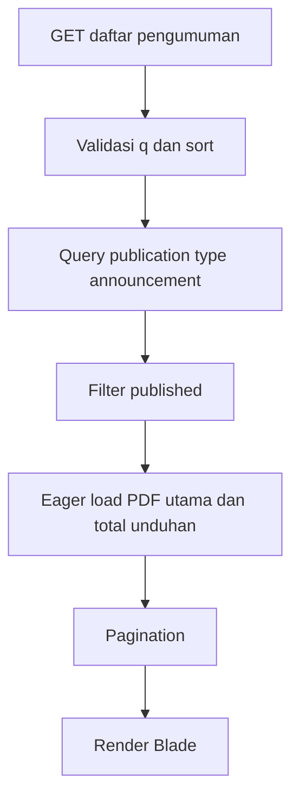
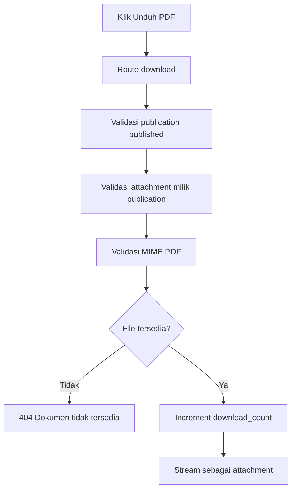

# ARSITEKTUR HALAMAN PENGUMUMAN DESA

**Proyek:** Website Profil Desa Sukomulyo  
**Fokus:** Informasi Desa → Pengumuman Desa  
**Framework yang digunakan:** Laravel 12, PHP 8.2, Blade, Tailwind CSS 4/Vite, MySQL  
**Status dokumen:** Rancangan layout dan arsitektur implementasi  
**Tanggal rancangan:** 29 Juli 2026

---

## 1. Tujuan Fitur

Halaman **Pengumuman Desa** digunakan untuk menampilkan informasi resmi dari Pemerintah Desa Sukomulyo dalam bentuk:

1. Judul pengumuman.
2. Pesan atau isi pengumuman.
3. Tanggal diterbitkan.
4. Satu atau lebih surat/lampiran PDF.
5. Tombol untuk melihat detail pengumuman.
6. Tombol untuk membuka PDF di browser.
7. Tombol untuk mengunduh PDF.
8. Jumlah unduhan lampiran.
9. Pencarian dan pengurutan pengumuman.
10. Pengelolaan pengumuman melalui halaman admin.

Pengumuman hanya tampil kepada masyarakat apabila memiliki status **published** dan waktu terbitnya sudah berlaku.

---

## 2. Keputusan Utama

| Bagian | Keputusan |
|---|---|
| Sumber data | Menggunakan tabel `publications` dengan `type = announcement` |
| Lampiran | Menggunakan tabel `publication_attachments` yang terhubung ke tabel `media` |
| Format lampiran | PDF (`application/pdf`) |
| Jumlah lampiran | Satu atau lebih PDF per pengumuman |
| PDF utama | Lampiran dengan `display_order` paling kecil |
| Halaman daftar | `/informasi-desa/pengumuman` |
| Halaman detail | `/informasi-desa/pengumuman/{slug}` |
| Pratinjau PDF | Dibuka melalui route aplikasi, bukan langsung melalui path penyimpanan |
| Unduhan PDF | Menggunakan response `attachment` dan mencatat jumlah unduhan |
| Warna utama | Mengikuti identitas website: hijau `#526b42` |
| Rendering | Server-side rendering menggunakan Blade |
| Pencarian | Judul dan ringkasan pengumuman |
| Pagination | 10 pengumuman per halaman |
| Urutan awal | Pengumuman terbaru |

---

## 3. Kondisi Repository Saat Ini

Repository telah memiliki fondasi yang sesuai untuk fitur ini:

- Model `Publication`.
- Model `PublicationAttachment`.
- Model `Media`.
- Tabel `publications`.
- Tabel `publication_attachments`.
- Relasi lampiran pada model publikasi.
- Route generik `/informasi-desa/{section}`.
- `PublicationController` untuk halaman informasi desa.
- `PublicSiteService::informationDetail()` untuk mengambil data publikasi.
- Resource admin `publications` dan `publication-attachments`.
- `MediaFileController` untuk mengirim file dari storage.

Namun, implementasi sekarang masih memiliki keterbatasan berikut:

1. Halaman pengumuman masih menggunakan panel informasi generik.
2. Lampiran belum dikirim ke Blade pada halaman pengumuman.
3. Belum ada halaman detail per pengumuman.
4. Belum ada route khusus untuk pratinjau dan unduhan PDF.
5. Belum ada pencatatan jumlah unduhan.
6. Form admin lampiran masih terpisah dari form publikasi sehingga alurnya kurang praktis.
7. Belum ada pencarian, pengurutan, dan pagination khusus pengumuman.

---

## 4. Arsitektur Informasi Halaman

### 4.1 Posisi pada Navigasi

```text
Informasi Desa
└── Pengumuman Desa
    ├── Daftar Pengumuman
    ├── Detail Pengumuman
    ├── Lihat Lampiran PDF
    └── Unduh Lampiran PDF
```

Breadcrumb halaman daftar:

```text
Beranda / Informasi Desa / Pengumuman Desa
```

Breadcrumb halaman detail:

```text
Beranda / Informasi Desa / Pengumuman Desa / Judul Pengumuman
```

---

## 5. Layout Halaman Daftar Pengumuman

### 5.1 Susunan Halaman

```text
┌─────────────────────────────────────────────────────────────────────┐
│ HEADER WEBSITE                                                     │
├─────────────────────────────────────────────────────────────────────┤
│ PAGE HEADER                                                        │
│ Pengumuman Desa                                                    │
│ Informasi resmi dan pengumuman penting Pemerintah Desa Sukomulyo   │
│ Beranda / Informasi Desa / Pengumuman Desa                         │
├─────────────────────────────────────────────────────────────────────┤
│ TOOLBAR                                                            │
│ ┌──────────────────────────────────────┐ ┌────────────────────────┐ │
│ │ 🔍 Cari pengumuman                   │ │ Terbaru              ▼ │ │
│ └──────────────────────────────────────┘ └────────────────────────┘ │
├─────────────────────────────────────────────────────────────────────┤
│ HASIL PENCARIAN / JUMLAH DATA                                      │
│ Menampilkan 1–10 dari 24 pengumuman                                │
├─────────────────────────────────────────────────────────────────────┤
│ ITEM PENGUMUMAN                                                    │
│ ┌────────┐ ┌───────────────────────────────────┐ ┌────────────────┐ │
│ │ JUL    │ │ Judul Pengumuman                  │ │ [Lihat]        │ │
│ │ 24     │ │ Ringkasan pesan pengumuman...     │ │ [Unduh PDF]   │ │
│ │ 2026   │ │ 📅 Diterbitkan 24 Jul 2026        │ └────────────────┘ │
│ └────────┘ │ 📎 1 lampiran · ↓ Diunduh 29 kali │                  │
│            └───────────────────────────────────┘                  │
├─────────────────────────────────────────────────────────────────────┤
│ ITEM PENGUMUMAN BERIKUTNYA                                         │
├─────────────────────────────────────────────────────────────────────┤
│ PAGINATION                                                          │
│ Sebelumnya    1  2  3    Berikutnya                                │
└─────────────────────────────────────────────────────────────────────┘
```

### 5.2 Toolbar

Toolbar terdiri dari:

- Input pencarian dengan placeholder **“Cari pengumuman”**.
- Tombol hapus pencarian ketika input terisi.
- Select pengurutan:
  - Terbaru.
  - Terlama.
  - Paling banyak diunduh.
- Submit otomatis setelah pengguna memilih urutan atau submit dengan tombol Enter.
- Query pencarian disimpan dalam URL agar halaman dapat dibagikan.

Contoh URL:

```text
/informasi-desa/pengumuman?q=musyawarah&sort=latest
```

### 5.3 Struktur Card/Row Pengumuman

Setiap card memuat:

| Area | Isi |
|---|---|
| Date badge | Bulan, tanggal, dan tahun terbit |
| Judul | Maksimal dua baris pada halaman daftar |
| Ringkasan | Maksimal dua baris; disembunyikan bila kosong |
| Metadata | Tanggal terbit, jumlah lampiran, total unduhan |
| Tombol Lihat | Membuka halaman detail pengumuman |
| Tombol Unduh PDF | Mengunduh PDF utama |

Aturan tombol:

- **Lihat** selalu tersedia.
- **Unduh PDF** hanya aktif jika terdapat lampiran PDF.
- Jika lampiran lebih dari satu, tombol tetap mengunduh PDF utama dan detail pengumuman menampilkan seluruh lampiran.
- Jika tidak terdapat lampiran, tampilkan label **“Tanpa Lampiran”** dan jangan menampilkan tombol unduh yang tidak berfungsi.

### 5.4 Empty State

Apabila belum ada pengumuman:

```text
[Ikon pengeras suara]
Belum Ada Pengumuman
Pengumuman resmi Pemerintah Desa Sukomulyo akan ditampilkan di halaman ini.
```

Apabila pencarian tidak menghasilkan data:

```text
[Ikon pencarian]
Pengumuman Tidak Ditemukan
Tidak ada pengumuman yang sesuai dengan kata kunci “...”
[Hapus Pencarian]
```

---

## 6. Layout Halaman Detail Pengumuman

### 6.1 Susunan Halaman

```text
┌─────────────────────────────────────────────────────────────────────┐
│ PAGE HEADER + BREADCRUMB                                            │
├─────────────────────────────────────────────────────────────────────┤
│ BADGE “PENGUMUMAN DESA”                                            │
│ Judul Pengumuman                                                    │
│ 📅 Diterbitkan 24 Juli 2026 · 📎 2 lampiran                        │
├───────────────────────────────────────┬─────────────────────────────┤
│ ISI PENGUMUMAN                        │ INFORMASI DOKUMEN           │
│                                       │ Nomor surat (opsional)      │
│ Pesan pengumuman lengkap.             │ Tanggal diterbitkan         │
│ Mendukung paragraf, daftar, tabel,     │ Masa berlaku                │
│ tautan, dan teks tebal.                │ Total unduhan               │
│                                       │                             │
├───────────────────────────────────────┴─────────────────────────────┤
│ LAMPIRAN                                                            │
│ ┌─────────────────────────────────────────────────────────────────┐ │
│ │ 📄 Surat Pengumuman Resmi.pdf                                  │ │
│ │ PDF · 1,8 MB · Diunduh 29 kali     [Lihat PDF] [Unduh PDF]     │ │
│ └─────────────────────────────────────────────────────────────────┘ │
│ ┌─────────────────────────────────────────────────────────────────┐ │
│ │ 📄 Jadwal Pelaksanaan.pdf                                      │ │
│ │ PDF · 860 KB · Diunduh 13 kali     [Lihat PDF] [Unduh PDF]     │ │
│ └─────────────────────────────────────────────────────────────────┘ │
├─────────────────────────────────────────────────────────────────────┤
│ [← Kembali ke Daftar Pengumuman]                                   │
└─────────────────────────────────────────────────────────────────────┘
```

### 6.2 Isi Pengumuman

Konten pengumuman dapat memuat:

- Paragraf.
- Daftar bernomor.
- Daftar poin.
- Tautan.
- Tabel sederhana.
- Teks tebal atau miring.

Konten dari editor admin wajib dibersihkan melalui `HtmlSanitizer` sebelum disimpan.

### 6.3 Daftar Lampiran

Setiap lampiran menampilkan:

- Ikon PDF.
- Judul tampilan lampiran.
- Nama file asli apabila judul tampilan kosong.
- Tipe file.
- Ukuran file.
- Jumlah unduhan.
- Tombol **Lihat PDF**.
- Tombol **Unduh PDF**.

Tombol **Lihat PDF** membuka tab baru dengan response `Content-Disposition: inline`.

Tombol **Unduh PDF** mengirim response `Content-Disposition: attachment` dan menaikkan `download_count` setelah file berhasil ditemukan.

---

## 7. Sistem Warna

Warna mengikuti variabel yang sudah digunakan website.

### 7.1 Token Warna

```css
:root {
    --primary: #526b42;
    --primary-dark: #3d5032;
    --primary-soft: #eef3ea;
    --primary-border: #d9e4d3;
    --accent: #efc62c;
    --ink: #252a31;
    --muted: #667085;
    --surface: #f6f6f4;
    --border: #e5e7eb;
    --white: #ffffff;
}
```

### 7.2 Penggunaan Warna

| Elemen | Warna |
|---|---|
| Tombol Unduh | `--primary` dengan teks putih |
| Hover tombol Unduh | `--primary-dark` |
| Tombol Lihat | Latar putih, border dan teks `--primary` |
| Hover tombol Lihat | Latar `--primary-soft` |
| Angka tanggal | `--primary` |
| Ikon metadata | `--primary` |
| Badge kategori | Latar `--primary-soft`, teks `--primary-dark` |
| Focus ring | `--accent` |
| Border card | `--primary-border` atau `--border` |
| Judul | `--ink` |
| Metadata | `--muted` |
| Latar halaman | Putih atau `--surface` sangat ringan |

### 7.3 Prinsip Visual

- Hijau digunakan sebagai aksen utama, bukan memenuhi seluruh card.
- Card tetap dominan putih agar isi mudah dibaca.
- Tombol utama **Unduh PDF** menggunakan hijau solid.
- Tombol sekunder **Lihat** menggunakan outline hijau.
- Warna kuning hanya digunakan untuk focus ring atau aksen kecil agar tidak bersaing dengan hijau.

---

## 8. Responsive Layout

### 8.1 Desktop — ≥ 1024 px

```text
Date badge | Konten fleksibel | Dua tombol sejajar
```

- Date badge: 94–104 px.
- Konten: memenuhi ruang yang tersedia.
- Area aksi: sekitar 280–320 px.
- Tombol memiliki tinggi minimum 48 px.

### 8.2 Tablet — 768–1023 px

```text
Date badge | Konten
           | Tombol Lihat + Unduh di bawah konten
```

- Toolbar masih dua kolom.
- Tombol dipindahkan ke bawah metadata.
- Ringkasan maksimal tiga baris.

### 8.3 Mobile — < 768 px

```text
[24 JUL 2026]
Judul pengumuman
Ringkasan
Metadata
[Lihat Pengumuman]
[Unduh PDF]
```

- Toolbar menjadi satu kolom.
- Date badge menjadi bentuk horizontal dan lebih kecil.
- Tombol menjadi lebar penuh.
- Judul tidak dipotong terlalu pendek.
- Metadata dapat membungkus ke baris berikutnya.
- Tidak menggunakan tabel horizontal yang memaksa scroll.

---

## 9. Struktur Komponen Blade

```text
resources/views/
├── pages/
│   └── announcements/
│       ├── index.blade.php
│       └── show.blade.php
│
└── components/
    └── announcements/
        ├── toolbar.blade.php
        ├── card.blade.php
        ├── date-badge.blade.php
        ├── metadata.blade.php
        ├── attachment-list.blade.php
        ├── attachment-item.blade.php
        └── empty-state.blade.php
```

### 9.1 Tanggung Jawab Komponen

| Komponen | Tanggung jawab |
|---|---|
| `toolbar` | Pencarian dan pengurutan |
| `card` | Satu item pengumuman pada halaman daftar |
| `date-badge` | Bulan, tanggal, dan tahun |
| `metadata` | Tanggal, jumlah lampiran, dan jumlah unduhan |
| `attachment-list` | Daftar seluruh PDF pada halaman detail |
| `attachment-item` | Informasi dan tombol sebuah PDF |
| `empty-state` | Kondisi data kosong atau pencarian tidak ditemukan |

Komponen tidak menjalankan query database. Semua data disiapkan oleh controller/service.

---

## 10. Struktur Backend yang Disarankan

```text
app/
├── Http/
│   ├── Controllers/
│   │   └── Web/
│   │       ├── AnnouncementController.php
│   │       └── AnnouncementAttachmentController.php
│   │
│   └── Requests/
│       ├── Web/
│       │   └── AnnouncementIndexRequest.php
│       └── Admin/
│           ├── StoreAnnouncementRequest.php
│           └── UpdateAnnouncementRequest.php
│
├── Actions/
│   └── Announcements/
│       ├── CreateAnnouncementAction.php
│       ├── UpdateAnnouncementAction.php
│       ├── DeleteAnnouncementAction.php
│       └── SyncAnnouncementAttachmentsAction.php
│
├── Services/
│   └── Announcements/
│       └── AnnouncementQueryService.php
│
├── Models/
│   ├── Publication.php
│   ├── PublicationAttachment.php
│   └── Media.php
│
└── Policies/
    └── PublicationPolicy.php
```

### 10.1 Controller Publik

`AnnouncementController` dibuat tipis:

```text
index()
├── Validasi query pencarian dan pengurutan
├── Memanggil AnnouncementQueryService
└── Mengembalikan pages.announcements.index

show()
├── Memastikan type = announcement
├── Memastikan status = published
├── Memastikan waktu terbit sudah berlaku
├── Memuat attachments.media
└── Mengembalikan pages.announcements.show
```

### 10.2 Controller Lampiran

`AnnouncementAttachmentController` memiliki dua method:

```text
preview(publication, attachment)
├── Pastikan pengumuman published
├── Pastikan attachment milik publication
├── Pastikan MIME application/pdf
├── Pastikan file tersedia
└── Stream file sebagai inline

 download(publication, attachment)
├── Pastikan pengumuman published
├── Pastikan attachment milik publication
├── Pastikan MIME application/pdf
├── Pastikan file tersedia
├── Tambahkan download_count
└── Stream file sebagai attachment
```

---

## 11. Route Publik

Route khusus diletakkan sebelum route informasi desa generik agar mudah dibaca dan dirawat.

```php
use App\Http\Controllers\Web\AnnouncementAttachmentController;
use App\Http\Controllers\Web\AnnouncementController;

Route::prefix('informasi-desa/pengumuman')
    ->name('announcements.')
    ->group(function () {
        Route::get('/', [AnnouncementController::class, 'index'])
            ->name('index');

        Route::get('/{publication:slug}', [AnnouncementController::class, 'show'])
            ->name('show');

        Route::get('/{publication:slug}/lampiran/{attachment}/lihat',
            [AnnouncementAttachmentController::class, 'preview'])
            ->middleware('throttle:120,1')
            ->name('attachments.preview');

        Route::get('/{publication:slug}/lampiran/{attachment}/unduh',
            [AnnouncementAttachmentController::class, 'download'])
            ->middleware('throttle:60,1')
            ->name('attachments.download');
    });
```

Route lama berikut dapat tetap digunakan untuk section lain:

```php
Route::get('/informasi-desa/{section}', ...)
    ->where('section', 'layanan-administrasi|agenda|bantuan-sosial|informasi-publik');
```

Kata `pengumuman` dikeluarkan dari route generik setelah halaman khusus aktif.

---

## 12. Route Admin

Untuk hasil akhir yang nyaman digunakan, pengumuman sebaiknya mempunyai form admin khusus.

```text
GET    /admin/pengumuman
GET    /admin/pengumuman/create
POST   /admin/pengumuman
GET    /admin/pengumuman/{publication}/edit
PUT    /admin/pengumuman/{publication}
DELETE /admin/pengumuman/{publication}
PATCH  /admin/pengumuman/{publication}/publish
PATCH  /admin/pengumuman/{publication}/archive
```

Semua route memakai:

```text
auth
active
can:manage-content
```

Implementasi MVP masih dapat memakai resource generik `publications`, tetapi form khusus lebih direkomendasikan karena admin perlu mengunggah, menghapus, dan mengurutkan PDF pada halaman yang sama.

---

## 13. Struktur Database

### 13.1 Tabel `publications`

Tabel ini sudah tersedia dan digunakan untuk data utama pengumuman.

```text
publications
- id
- type                       announcement
- title
- slug
- excerpt
- content
- featured_image_id          nullable
- start_date                 nullable
- end_date                   nullable
- published_at               nullable
- status                     draft | published | archived
- author_id
- seo_title                  nullable
- seo_description            nullable
- created_at
- updated_at
- deleted_at
```

Tidak perlu membuat tabel `announcements` baru karena akan menduplikasi fungsi `publications`.

### 13.2 Tabel `publication_attachments`

Tabel telah tersedia. Tambahkan kolom penghitung unduhan.

```text
publication_attachments
- id
- publication_id
- media_id
- title                      nullable
- display_order              default 0
- download_count             default 0   ← tambahan
- created_at
- updated_at
```

Migration tambahan:

```php
Schema::table('publication_attachments', function (Blueprint $table) {
    $table->unsignedBigInteger('download_count')
        ->default(0)
        ->after('display_order');
});
```

Penghitungan total unduhan sebuah pengumuman diperoleh dari penjumlahan seluruh `download_count` lampiran. Tidak perlu menyimpan total yang sama pada tabel `publications`.

### 13.3 Tabel `media`

Tabel ini menyimpan identitas dan lokasi file.

Untuk lampiran PDF:

```text
mime_type    = application/pdf
extension    = pdf
storage_path = dokumen-publik/pengumuman/{slug}/{nama-file}.pdf
```

---

## 14. Relasi Data



---

## 15. Perubahan Model

### 15.1 `Publication`

Tanggung jawab model:

- Relasi author.
- Relasi attachment terurut.
- Scope published.
- Scope announcement.
- Route model binding berdasarkan slug.
- Accessor PDF utama.

Rancangan:

```php
public function attachments()
{
    return $this->hasMany(PublicationAttachment::class)
        ->orderBy('display_order')
        ->orderBy('id');
}

public function scopeAnnouncements(Builder $query): Builder
{
    return $query->where('type', 'announcement');
}

public function getRouteKeyName(): string
{
    return 'slug';
}

public function primaryAttachment()
{
    return $this->hasOne(PublicationAttachment::class)
        ->ofMany('display_order', 'min');
}
```

### 15.2 `PublicationAttachment`

Tambahkan cast dan relasi media.

```php
protected $casts = [
    'download_count' => 'integer',
    'display_order' => 'integer',
];
```

---

## 16. Query Halaman Daftar

Query tidak ditempatkan di Blade.

```php
Publication::query()
    ->announcements()
    ->published()
    ->with([
        'primaryAttachment.media',
    ])
    ->withCount('attachments')
    ->withSum('attachments as total_downloads', 'download_count')
    ->when($search, function ($query, $search) {
        $query->where(function ($subQuery) use ($search) {
            $subQuery->where('title', 'like', "%{$search}%")
                ->orWhere('excerpt', 'like', "%{$search}%");
        });
    })
    ->when($sort === 'oldest', fn ($query) =>
        $query->orderBy('published_at'))
    ->when($sort === 'most_downloaded', fn ($query) =>
        $query->orderByDesc('total_downloads'))
    ->when($sort === 'latest', fn ($query) =>
        $query->orderByDesc('published_at'))
    ->paginate(10)
    ->withQueryString();
```

Nilai `sort` yang diizinkan:

```text
latest
oldest
most_downloaded
```

Nilai lain dikembalikan ke `latest`.

---

## 17. Alur Sistem

### 17.1 Alur Admin Membuat Pengumuman



### 17.2 Alur Pengunjung Membuka Daftar



### 17.3 Alur Unduh PDF



---

## 18. Form Admin Pengumuman

### 18.1 Field Utama

| Field | Tipe | Aturan |
|---|---|---|
| Jenis | Hidden | Selalu `announcement` |
| Judul | Text | Wajib, 5–255 karakter |
| Slug | Text/otomatis | Unik, dapat dibuat dari judul |
| Ringkasan | Textarea | Opsional, maksimal 1000 karakter |
| Isi pengumuman | Editor | Wajib, disanitasi |
| Tanggal mulai | Date | Opsional |
| Tanggal selesai | Date | Opsional, tidak sebelum tanggal mulai |
| Waktu terbit | Datetime | Wajib ketika status published |
| Status | Select | Draft, Published, Archived |
| Judul SEO | Text | Opsional |
| Deskripsi SEO | Textarea | Opsional, maksimal 320 karakter |

### 18.2 Field Lampiran

Setiap lampiran memiliki:

- File PDF.
- Judul tampilan.
- Urutan.
- Tombol hapus.
- Tombol lihat file yang sudah tersimpan.

Fitur form:

- Drag-and-drop beberapa PDF.
- Reorder lampiran.
- Preview nama dan ukuran file.
- Menandai lampiran pertama sebagai PDF utama.
- Konfirmasi sebelum menghapus lampiran yang sudah tersimpan.

### 18.3 Validasi PDF

```text
required atau nullable sesuai operasi
file
mimes:pdf
mimetypes:application/pdf
max:10240
```

Batas awal yang disarankan adalah **10 MB per PDF**. Nilai dapat dinaikkan melalui konfigurasi apabila surat hasil pemindaian berukuran lebih besar.

Validasi tidak hanya mengandalkan ekstensi file.

---

## 19. Penyimpanan File

Struktur folder:

```text
storage/app/public/
└── dokumen-publik/
    └── pengumuman/
        └── {slug-pengumuman}/
            ├── surat-pengumuman.pdf
            └── jadwal-pelaksanaan.pdf
```

Aturan nama file tersimpan:

```text
{uuid-atau-random-string}.pdf
```

Nama file asli tetap disimpan pada kolom `media.original_name`.

Jangan memakai nama file dari pengguna secara langsung sebagai path final karena berisiko menyebabkan konflik nama atau karakter path yang tidak aman.

---

## 20. Keamanan

1. Hanya pengumuman published yang boleh diakses publik.
2. Attachment harus dipastikan benar-benar milik pengumuman pada URL.
3. File harus tersedia pada disk sebelum penghitung unduhan dinaikkan.
4. MIME harus `application/pdf`.
5. Response memakai header `X-Content-Type-Options: nosniff`.
6. Nama file pada header harus disanitasi.
7. Isi editor dibersihkan melalui `HtmlSanitizer`.
8. Route unduhan diberi rate limit.
9. Upload admin dilindungi autentikasi, authorization, dan CSRF.
10. Perubahan admin dicatat pada activity log.
11. Query pencarian memakai query builder/Eloquent, bukan SQL manual.
12. Jangan mengirim `storage_path` mentah ke halaman publik.
13. PDF draft tidak dapat diakses melalui route publik.
14. Penghapusan media harus memeriksa apakah file masih digunakan oleh data lain.

---

## 21. Aksesibilitas

- Input pencarian memiliki `<label>` yang dapat disembunyikan secara visual tetapi tetap dibaca screen reader.
- Tombol **Lihat PDF** menjelaskan bahwa dokumen dibuka di tab baru.
- Ikon selalu disertai teks; jangan memakai ikon sebagai satu-satunya informasi.
- Warna hijau bukan satu-satunya indikator status.
- Focus ring menggunakan warna kuning `--accent` dengan kontras yang jelas.
- Area klik tombol minimal 44 × 44 px.
- Judul menggunakan urutan heading yang benar: `h1`, lalu `h2`, lalu `h3`.
- PDF memiliki judul yang mudah dipahami, bukan hanya `scan001.pdf`.
- Tombol disabled tidak hanya diubah warnanya tetapi juga memakai atribut `disabled` bila berupa button.
- Informasi jumlah unduhan dapat dibaca sebagai kalimat, misalnya “Diunduh 29 kali”.

---

## 22. SEO dan Metadata

Halaman daftar:

```text
Title: Pengumuman Desa | Desa Sukomulyo
Description: Informasi resmi dan pengumuman terbaru dari Pemerintah Desa Sukomulyo.
Canonical: /informasi-desa/pengumuman
```

Halaman detail:

```text
Title: {seo_title atau title} | Desa Sukomulyo
Description: {seo_description atau excerpt}
Canonical: /informasi-desa/pengumuman/{slug}
```

Pengumuman published dapat ditambahkan ke sitemap.

PDF tidak perlu dimasukkan sebagai URL terpisah ke sitemap pada tahap awal.

---

## 23. CSS Class yang Disarankan

```text
.announcement-page
.announcement-toolbar
.announcement-search
.announcement-sort
.announcement-results-meta
.announcement-list
.announcement-card
.announcement-date
.announcement-date-month
.announcement-date-day
.announcement-date-year
.announcement-content
.announcement-title
.announcement-excerpt
.announcement-meta
.announcement-actions
.announcement-button
.announcement-button--view
.announcement-button--download
.announcement-empty
.announcement-detail
.announcement-detail-meta
.announcement-body
.announcement-sidebar
.announcement-attachments
.announcement-attachment
```

Nama class khusus mencegah benturan dengan class generik lama seperti `.data-panel` dan memudahkan pengembangan halaman ini tanpa merusak halaman informasi desa lainnya.

---

## 24. Perilaku Interaksi

### Pencarian

- Submit dengan Enter.
- Nilai query tetap tampil setelah reload.
- Tombol hapus muncul ketika input tidak kosong.
- Pencarian dilakukan di server agar tetap bekerja tanpa JavaScript.

### Pengurutan

- Select dapat submit otomatis dengan JavaScript.
- Tetap menyediakan fallback tombol submit atau bekerja ketika form dikirim manual.

### Tombol Lihat

- Membuka detail pengumuman pada tab yang sama.

### Tombol Lihat PDF

- Membuka PDF pada tab baru.
- Menggunakan `rel="noopener"` bila menggunakan `target="_blank"`.

### Tombol Unduh

- Mengunduh file dengan nama yang ramah pengguna.
- Penghitung naik pada request download yang valid.

---

## 25. Data yang Dikirim ke Blade

### Halaman Daftar

```text
$announcements             LengthAwarePaginator
$filters.search            string|null
$filters.sort              latest|oldest|most_downloaded
```

Setiap item menyediakan:

```text
id
slug
title
excerpt
published_at
start_date
attachments_count
total_downloads
primary_attachment
```

### Halaman Detail

```text
$announcement
├── title
├── excerpt
├── content
├── published_at
├── start_date
├── end_date
├── seo_title
├── seo_description
└── attachments
    └── media
```

---

## 26. Index Database

Index yang sudah ada pada `publications` tetap digunakan:

```text
INDEX type
INDEX status, published_at
INDEX type, status, published_at
UNIQUE slug
```

Tambahan opsional apabila jumlah data sangat besar:

```text
FULLTEXT title, excerpt
```

Untuk tahap awal, pencarian `LIKE` pada judul dan ringkasan sudah mencukupi karena volume pengumuman desa diperkirakan tidak besar.

---

## 27. Cache

Daftar pengumuman dapat menggunakan cache per kombinasi filter hanya jika traffic meningkat. Pada tahap awal, query langsung dengan index lebih sederhana dan aman.

Apabila cache diterapkan:

```text
announcements:index:{hash-query}
announcements:detail:{slug}
```

Cache harus dihapus ketika:

- Pengumuman dibuat.
- Pengumuman diperbarui.
- Pengumuman dipublikasikan.
- Pengumuman diarsipkan.
- Lampiran ditambah, diubah, atau dihapus.

`download_count` tidak perlu menghapus seluruh cache detail setiap kali bertambah apabila angka unduhan ditampilkan secara toleran terhadap keterlambatan singkat. Bila angka harus real-time, bagian tersebut jangan dicache.

---

## 28. Pengujian

### 28.1 Feature Test Publik

```text
✓ Daftar hanya menampilkan type announcement
✓ Draft tidak tampil
✓ Archived tidak tampil
✓ Published dengan waktu masa depan tidak tampil
✓ Pencarian judul bekerja
✓ Pencarian ringkasan bekerja
✓ Sort terbaru bekerja
✓ Sort terlama bekerja
✓ Sort paling banyak diunduh bekerja
✓ Pagination mempertahankan query string
✓ Detail menggunakan slug
✓ Slug pengumuman tipe lain menghasilkan 404
✓ Lampiran milik pengumuman lain menghasilkan 404
✓ Preview mengirim Content-Disposition inline
✓ Download mengirim Content-Disposition attachment
✓ Download menaikkan download_count
✓ File tidak tersedia menghasilkan 404 tanpa menaikkan count
```

### 28.2 Feature Test Admin

```text
✓ Pengunjung tidak dapat membuka admin
✓ Admin tanpa izin manage-content ditolak
✓ Judul wajib
✓ Konten wajib
✓ Slug unik
✓ Hanya PDF yang diterima
✓ File di atas batas ditolak
✓ Beberapa PDF dapat disimpan
✓ Urutan lampiran tersimpan
✓ Menghapus pengumuman menghapus relasi attachment
✓ Perubahan dicatat pada activity log
```

### 28.3 Browser/Responsive Test

```text
✓ Desktop 1440 px
✓ Laptop 1024 px
✓ Tablet 768 px
✓ Mobile 390 px
✓ Keyboard navigation
✓ Focus state
✓ Long title
✓ Empty excerpt
✓ No attachment
✓ Multiple attachments
✓ Large download count
```

---

## 29. Acceptance Criteria

Fitur dianggap selesai apabila:

1. Menu **Informasi Desa → Pengumuman Desa** membuka halaman daftar khusus.
2. Pengumuman ditampilkan dalam card/row seperti referensi, tetapi memakai identitas hijau website.
3. Halaman memiliki pencarian dan pengurutan.
4. Setiap pengumuman menampilkan tanggal, judul, ringkasan, dan metadata.
5. Tombol **Lihat** membuka detail pengumuman.
6. Detail menampilkan isi pesan lengkap.
7. Admin dapat melampirkan satu atau lebih PDF.
8. Masyarakat dapat melihat PDF di browser.
9. Masyarakat dapat mengunduh PDF.
10. Jumlah unduhan dicatat per lampiran.
11. Draft dan arsip tidak dapat diakses publik.
12. Tampilan bekerja pada desktop, tablet, dan mobile.
13. Upload non-PDF ditolak.
14. Seluruh perubahan admin tercatat pada activity log.
15. Pengujian utama lulus.

---

## 30. Urutan Implementasi

### Tahap 1 — Database dan Model

1. Tambahkan `download_count` ke `publication_attachments`.
2. Perbarui relasi dan cast model.
3. Tambahkan scope `announcements` dan route key slug.

### Tahap 2 — Route dan Backend Publik

1. Buat `AnnouncementController`.
2. Buat `AnnouncementAttachmentController`.
3. Buat `AnnouncementIndexRequest`.
4. Tambahkan route daftar, detail, preview, dan download.
5. Keluarkan `pengumuman` dari route detail informasi generik.

### Tahap 3 — Blade dan CSS

1. Buat halaman daftar.
2. Buat halaman detail.
3. Buat komponen card dan attachment.
4. Tambahkan CSS khusus dengan token warna existing.
5. Implementasikan empty state dan responsive layout.

### Tahap 4 — Admin

1. Buat form pengumuman khusus.
2. Integrasikan multi-upload PDF.
3. Tambahkan reorder dan remove attachment.
4. Tambahkan publish/archive.
5. Tambahkan activity log dan cache invalidation.

### Tahap 5 — Pengujian

1. Feature test publik.
2. Feature test admin.
3. Pengujian PDF storage lokal dan object storage.
4. Pengujian responsive dan aksesibilitas.

---

## 31. File yang Kemungkinan Diubah atau Ditambahkan

```text
routes/web.php

app/Models/Publication.php
app/Models/PublicationAttachment.php

app/Http/Controllers/Web/AnnouncementController.php
app/Http/Controllers/Web/AnnouncementAttachmentController.php
app/Http/Requests/Web/AnnouncementIndexRequest.php

app/Services/Announcements/AnnouncementQueryService.php

resources/views/pages/announcements/index.blade.php
resources/views/pages/announcements/show.blade.php
resources/views/components/announcements/toolbar.blade.php
resources/views/components/announcements/card.blade.php
resources/views/components/announcements/date-badge.blade.php
resources/views/components/announcements/attachment-list.blade.php
resources/views/components/announcements/attachment-item.blade.php
resources/views/components/announcements/empty-state.blade.php

resources/css/app.css

database/migrations/xxxx_xx_xx_xxxxxx_add_download_count_to_publication_attachments.php

tests/Feature/Web/AnnouncementTest.php
tests/Feature/Web/AnnouncementAttachmentTest.php
tests/Feature/Admin/AnnouncementManagementTest.php
```

Untuk form admin terintegrasi, tambahkan:

```text
app/Http/Controllers/Admin/AnnouncementController.php
app/Http/Requests/Admin/StoreAnnouncementRequest.php
app/Http/Requests/Admin/UpdateAnnouncementRequest.php
app/Actions/Announcements/CreateAnnouncementAction.php
app/Actions/Announcements/UpdateAnnouncementAction.php
app/Actions/Announcements/SyncAnnouncementAttachmentsAction.php
resources/views/admin/announcements/index.blade.php
resources/views/admin/announcements/form.blade.php
```

---

## 32. Ringkasan Desain Final

Halaman pengumuman menggunakan gaya daftar resmi seperti referensi:

- Date badge berada di sisi kiri.
- Judul dan metadata berada di bagian tengah.
- Tombol aksi berada di sisi kanan pada desktop.
- Warna ungu pada referensi diganti dengan hijau utama website.
- Tombol **Lihat** memakai outline hijau.
- Tombol **Unduh PDF** memakai hijau solid.
- Latar card tetap putih agar bersih dan mudah dibaca.
- Isi pesan lengkap dan seluruh PDF tersedia pada halaman detail.
- PDF dapat dibuka maupun diunduh dengan route aplikasi yang aman.
- Struktur memanfaatkan tabel `publications`, `publication_attachments`, dan `media` yang sudah ada sehingga tidak membuat data ganda.

---

## 33. Referensi Repository

- Repository: `https://github.com/alvinputra2005/Website-Profil-Desa-Sukomulyo`
- Route saat ini: `routes/web.php`
- Controller publikasi: `app/Http/Controllers/Web/PublicationController.php`
- Service situs publik: `app/Services/Web/PublicSiteService.php`
- Model publikasi: `app/Models/Publication.php`
- Model lampiran: `app/Models/PublicationAttachment.php`
- Konfigurasi resource admin: `config/admin.php`
- View informasi saat ini: `resources/views/pages/information-detail.blade.php`
- Warna utama website: `resources/css/app.css`

