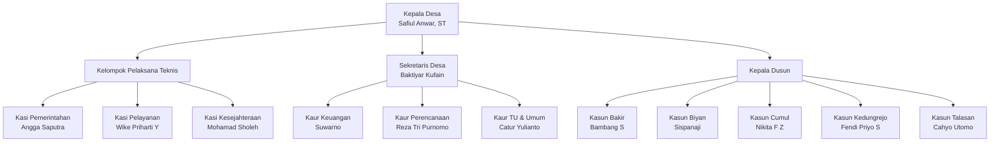
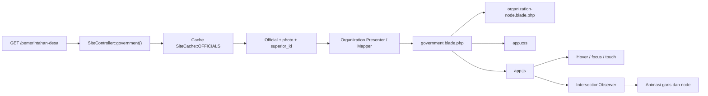

# Arsitektur Struktur Pemerintahan Interaktif

**Proyek:** Website Profil Desa Sukomulyo  
**Branch target:** `feature/profile-desa/struktur-pemerintahan`  
**Halaman publik:** `/pemerintahan-desa`  
**Framework:** Laravel + Blade + Vite + CSS dan JavaScript vanilla

---

## 1. Tujuan

Membangun struktur organisasi Pemerintah Desa Sukomulyo yang:

1. Menampilkan hierarki perangkat desa secara jelas.
2. Pada kondisi awal hanya menampilkan:
   - foto berbentuk lingkaran;
   - jabatan di bawah foto.
3. Menampilkan nama perangkat ketika foto, lingkaran, atau jabatan:
   - di-hover;
   - menerima fokus keyboard;
   - diketuk pada perangkat layar sentuh.
4. Memberikan efek “terpilih” berupa:
   - skala sedikit membesar;
   - posisi sedikit terangkat;
   - bayangan lembut;
   - garis tepi yang lebih tegas.
5. Menganimasikan garis organisasi saat pengguna melakukan scroll:
   - garis induk muncul lebih dahulu;
   - garis cabang menyusul;
   - anak struktur tampil setelah garis yang menghubungkannya selesai.
6. Tetap nyaman digunakan pada desktop, tablet, dan ponsel.
7. Tidak menggunakan gaya visual berlebihan seperti glow, gradien mencolok, atau animasi yang terasa generik.
8. Tetap aksesibel bagi pengguna keyboard dan pengguna yang memilih pengurangan gerakan.

---

## 2. Kondisi Implementasi Saat Ini

Halaman struktur pemerintahan sekarang menggunakan grid kartu datar melalui:

```text
resources/views/pages/government.blade.php
```

Data perangkat desa disiapkan oleh:

```text
app/Http/Controllers/SiteController.php
└── government()
```

Route publik yang digunakan:

```php
Route::get('/pemerintahan-desa', 'government')
    ->name('pemerintahan-desa');
```

Style saat ini berada di:

```text
resources/css/app.css
```

JavaScript publik berada di:

```text
resources/js/app.js
```

Model `Official` sudah mempunyai relasi hierarki:

```php
public function superior()
{
    return $this->belongsTo(self::class, 'superior_id');
}

public function subordinates()
{
    return $this->hasMany(self::class, 'superior_id')
        ->orderBy('display_order');
}
```

Artinya, arsitektur database sebenarnya sudah mendukung hubungan atasan dan bawahan melalui `superior_id`. Tidak perlu membuat tabel organisasi baru selama data `superior_id` telah diisi dengan benar.

---

## 3. Struktur Organisasi Acuan

Struktur mengikuti gambar:

```text
public/assets/gambar-struktur-pemerintahan.png
```

Hierarki visual yang digunakan:



### 3.1 Susunan tampilan desktop

```text
                         [ KEPALA DESA ]
                                │
             ┌──────────────────┼──────────────────┐
             │                  │                  │
       KELOMPOK KASI       SEKRETARIS DESA     GARIS KE KASUN
             │                  │                  │
       ┌─────┼─────┐      ┌─────┼─────┐      ┌─────┼─────┬─────┬─────┐
       │     │     │      │     │     │      │     │     │     │     │
     KASI  KASI  KASI    KAUR  KAUR  KAUR   KASUN KASUN KASUN KASUN KASUN
```

Tampilan tidak dibuat sebagai kartu besar. Setiap orang menjadi sebuah **node ringan** yang berisi foto lingkaran dan jabatan.

---

## 4. Pemetaan Foto

Pemetaan awal berdasarkan aset pada branch:

| Nama | Jabatan | Aset |
|---|---|---|
| Safiul Anwar, ST | Kepala Desa | `/assets/safiul-anwar.jpeg` |
| Angga Saputra | Kasi Pemerintahan | `/assets/angga-saputra.jpeg` |
| Wike Priharti Y | Kasi Pelayanan | `/assets/wike-priharti-y.jpeg` |
| Mohamad Sholeh | Kasi Kesejahteraan | `/assets/muhammad-sholeh.jpeg` |
| Suwarno | Kaur Keuangan | `/assets/suwarno.jpeg` |
| Reza Tri Purnomo | Kaur Perencanaan | `/assets/reza-tri.jpeg` |
| Catur Yulianto | Kaur TU & Umum | `/assets/catur-yulianto.jpeg` |
| Bambang S | Kasun Bakir | `/assets/bambang.jpeg` |
| Sispanaji | Kasun Biyan | `/assets/sispanaji.jpeg` |
| Nikita F Z | Kasun Cumul | `/assets/nikita.jpeg` |
| Fendi Priyo S | Kasun Kedungrejo | `/assets/fendi-priyo.jpeg` |
| Baktiyar Kufain | Sekretaris Desa | foto khusus belum terlihat pada daftar aset |
| Cahyo Utomo | Kasun Talasan | foto khusus belum terlihat pada daftar aset |

### Catatan validasi

Nama pada database harus dijadikan sumber utama. Pemetaan aset di atas adalah kerangka awal. Dua foto yang belum ditemukan dapat memakai avatar sementara sampai aset asli ditambahkan.

Untuk `muhammad-sholeh.jpeg`, perlu pemeriksaan manual karena tulisan pada gambar menggunakan “Mohamad Sholeh”, sedangkan nama file memakai “muhammad”.

---

## 5. Arsitektur Halaman

### 5.1 Diagram aliran



### 5.2 Pembagian tanggung jawab

| Lapisan | Tanggung jawab |
|---|---|
| Route | Membuka halaman struktur pemerintahan |
| Controller | Mengambil data aktif, mengurutkan, dan membangun struktur |
| Model | Menyediakan data pejabat, foto, atasan, dan bawahan |
| Blade utama | Menyusun kelompok dan garis hierarki |
| Partial node | Menampilkan satu perangkat desa secara konsisten |
| CSS | Layout, garis, hover, tooltip nama, dan responsive |
| JavaScript | Scroll reveal, interaksi sentuh, keyboard, dan status aktif |
| Test | Memastikan struktur, nama, jabatan, dan aksesibilitas dasar benar |

---

## 6. Struktur File yang Direkomendasikan

```text
app/
└── Http/
    └── Controllers/
        └── SiteController.php

resources/
├── css/
│   └── app.css
├── js/
│   └── app.js
└── views/
    └── pages/
        ├── government.blade.php
        └── partials/
            └── organization-node.blade.php

public/
└── assets/
    ├── safiul-anwar.jpeg
    ├── angga-saputra.jpeg
    ├── wike-priharti-y.jpeg
    ├── muhammad-sholeh.jpeg
    ├── suwarno.jpeg
    ├── reza-tri.jpeg
    ├── catur-yulianto.jpeg
    ├── bambang.jpeg
    ├── sispanaji.jpeg
    ├── nikita.jpeg
    ├── fendi-priyo.jpeg
    ├── baktiyar-kufain.jpeg
    └── cahyo-utomo.jpeg

tests/
└── Feature/
    └── GovernmentPageTest.php
```

Tidak perlu membuat file JavaScript atau CSS terpisah apabila proyek ingin tetap mengikuti pola saat ini. Kode cukup dikelompokkan dalam bagian khusus di `app.css` dan fungsi initializer di `app.js`.

---

## 7. Kontrak Data

Setiap node menerima data berikut:

```php
[
    'id' => 1,
    'name' => 'Safiul Anwar, ST',
    'role' => 'Kepala Desa',
    'photo' => '/assets/safiul-anwar.jpeg',
    'photo_alt' => 'Safiul Anwar, ST - Kepala Desa Sukomulyo',
    'superior_id' => null,
    'display_order' => 1,
]
```

### 7.1 Bentuk data untuk view

Untuk desain khusus seperti gambar acuan, data sebaiknya disiapkan menjadi kelompok eksplisit:

```php
[
    'leader' => [...],
    'technicalExecutors' => [
        [...],
        [...],
        [...],
    ],
    'secretary' => [...],
    'secretariatStaff' => [
        [...],
        [...],
        [...],
    ],
    'hamletHeads' => [
        [...],
        [...],
        [...],
        [...],
        [...],
    ],
]
```

Bentuk ini lebih stabil daripada memaksa seluruh diagram dirender secara rekursif karena struktur acuan memiliki cabang visual yang tidak simetris.

---

## 8. Kerangka Controller

Controller tidak lagi mengirim daftar datar. Controller menyiapkan kelompok hierarki.

```php
public function government(): View
{
    $officials = $this->cache->remember(
        SiteCache::OFFICIALS,
        SiteCache::ONE_HOUR,
        fn () => Schema::hasTable('officials')
            ? Official::query()
                ->with('photo')
                ->where('is_active', true)
                ->orderBy('display_order')
                ->get()
                ->map(fn (Official $official) => [
                    'id' => $official->id,
                    'role' => $official->position_label,
                    'name' => $official->full_name,
                    'photo' => $official->photo?->url,
                    'photo_alt' => $official->photo?->alt_text
                        ?: $official->full_name.' - '.$official->position_label,
                    'superior_id' => $official->superior_id,
                    'display_order' => $official->display_order,
                ])
                ->values()
            : collect()
    );

    $findRole = static function ($officials, array $needles) {
        return $officials->first(function (array $official) use ($needles) {
            $role = mb_strtolower($official['role']);

            foreach ($needles as $needle) {
                if (str_contains($role, mb_strtolower($needle))) {
                    return true;
                }
            }

            return false;
        });
    };

    $filterRoles = static function ($officials, array $needles) {
        return $officials
            ->filter(function (array $official) use ($needles) {
                $role = mb_strtolower($official['role']);

                foreach ($needles as $needle) {
                    if (str_contains($role, mb_strtolower($needle))) {
                        return true;
                    }
                }

                return false;
            })
            ->values()
            ->all();
    };

    $organization = [
        'leader' => $findRole($officials, ['kepala desa']),
        'technicalExecutors' => $filterRoles($officials, ['kasi']),
        'secretary' => $findRole($officials, ['sekretaris desa']),
        'secretariatStaff' => $filterRoles($officials, ['kaur']),
        'hamletHeads' => $filterRoles($officials, ['kasun', 'kepala dusun']),
    ];

    return $this->render('pages.government', [
        'organization' => $organization,
        ...$this->profilePageData('struktur-pemerintahan'),
    ]);
}
```

### 8.1 Rekomendasi lanjutan

Pencarian berdasarkan teks jabatan cocok sebagai transisi awal. Untuk jangka panjang, gunakan `superior_id` dan kode jabatan yang konsisten agar perubahan ejaan tidak memengaruhi layout.

Contoh pengembangan:

```text
position_code:
- village_head
- village_secretary
- section_head_government
- section_head_service
- section_head_welfare
- administrative_head_finance
- administrative_head_planning
- administrative_head_general
- hamlet_head
```

---

## 9. Partial Node

File:

```text
resources/views/pages/partials/organization-node.blade.php
```

Kerangka:

```blade
@props([
    'official',
    'size' => 'default',
    'delay' => 0,
])

@if ($official)
    <button
        type="button"
        class="org-node org-node--{{ $size }}"
        data-org-node
        aria-expanded="false"
        style="--org-node-delay: {{ $delay }}ms"
    >
        <span class="org-node__portrait">
            @if (!empty($official['photo']))
                
            @else
                <span class="org-node__fallback" aria-hidden="true">
                    <i class="fas fa-user"></i>
                </span>
            @endif
        </span>

        <span class="org-node__role">
            {{ $official['role'] }}
        </span>

        <span class="org-node__name" data-org-name>
            {{ $official['name'] }}
        </span>
    </button>
@endif
```

### Alasan menggunakan elemen `button`

- dapat menerima fokus keyboard;
- dapat diaktifkan menggunakan Enter atau Space;
- cocok untuk membuka dan menutup nama pada layar sentuh;
- tidak membutuhkan `tabindex` tambahan;
- status dapat disampaikan melalui `aria-expanded`.

---

## 10. Kerangka Blade Utama

Bagian grid lama diganti dengan struktur khusus.

```blade
<x-layouts.app
    title="Struktur Pemerintahan"
    description="Struktur organisasi Pemerintah Desa Sukomulyo."
>
    <x-page-header
        title="Struktur Pemerintahan"
        description="Struktur organisasi Pemerintah Desa Sukomulyo."
        :breadcrumbs="[
            ['label' => 'Profile Desa', 'url' => route('profile-desa')],
            ['label' => 'Struktur Pemerintahan'],
        ]"
    />

    <main class="government-page">
        <section
            class="government-organization"
            data-org-tree
            aria-labelledby="government-organization-title"
        >
            <header class="government-organization__intro">
                <span class="section-kicker">Struktur Organisasi</span>

                <h1 id="government-organization-title">
                    Pemerintah Desa Sukomulyo
                </h1>

                <p>
                    Arahkan kursor atau fokuskan perangkat desa untuk melihat nama.
                </p>
            </header>

            <div class="org-chart-scroll">
                <div class="org-chart">
                    <div class="org-chart__leader">
                        @include('pages.partials.organization-node', [
                            'official' => $organization['leader'],
                            'size' => 'leader',
                            'delay' => 80,
                        ])
                    </div>

                    <span
                        class="org-line org-line--leader-down"
                        aria-hidden="true"
                    ></span>

                    <div class="org-chart__middle">
                        <section class="org-branch org-branch--technical">
                            <span
                                class="org-line org-line--branch"
                                aria-hidden="true"
                            ></span>

                            <div class="org-branch__nodes">
                                @foreach ($organization['technicalExecutors'] as $official)
                                    @include('pages.partials.organization-node', [
                                        'official' => $official,
                                        'delay' => 260 + ($loop->index * 90),
                                    ])
                                @endforeach
                            </div>
                        </section>

                        <section class="org-branch org-branch--secretariat">
                            @include('pages.partials.organization-node', [
                                'official' => $organization['secretary'],
                                'size' => 'emphasis',
                                'delay' => 250,
                            ])

                            <span
                                class="org-line org-line--secretary-down"
                                aria-hidden="true"
                            ></span>

                            <div class="org-branch__nodes">
                                @foreach ($organization['secretariatStaff'] as $official)
                                    @include('pages.partials.organization-node', [
                                        'official' => $official,
                                        'delay' => 410 + ($loop->index * 90),
                                    ])
                                @endforeach
                            </div>
                        </section>
                    </div>

                    <section class="org-chart__hamlets">
                        <span
                            class="org-line org-line--hamlets-down"
                            aria-hidden="true"
                        ></span>

                        <span
                            class="org-line org-line--hamlets-horizontal"
                            aria-hidden="true"
                        ></span>

                        <div class="org-chart__hamlet-nodes">
                            @foreach ($organization['hamletHeads'] as $official)
                                @include('pages.partials.organization-node', [
                                    'official' => $official,
                                    'delay' => 620 + ($loop->index * 90),
                                ])
                            @endforeach
                        </div>
                    </section>
                </div>
            </div>

            <p class="org-chart__hint">
                Pada perangkat sentuh, ketuk foto atau jabatan untuk menampilkan nama.
            </p>
        </section>

        {{-- Komentar utama dapat tetap dipertahankan bila dibutuhkan. --}}
        <x-profile-comment-section :context="$commentContext" />
    </main>
</x-layouts.app>
```

---

## 11. Struktur Visual Node

Kondisi normal:

```text
         ┌───────────────┐
         │  FOTO BULAT   │
         └───────────────┘
            JABATAN
```

Kondisi hover, fokus, atau aktif:

```text
       ┌───────────────────┐
       │ FOTO MEMBESAR     │
       └───────────────────┘
             JABATAN

       ┌───────────────────┐
       │ NAMA PERANGKAT    │
       └───────────────────┘
```

Nama tidak mengambil ruang tetap pada layout desktop. Nama muncul sebagai panel kecil di bawah jabatan sehingga diagram tidak berubah posisi ketika pengguna melakukan hover.

---

## 12. Arsitektur CSS

### 12.1 Token lokal

```css
.government-organization {
    --org-ink: #27312a;
    --org-green: #526b42;
    --org-green-dark: #34462d;
    --org-line: #48665a;
    --org-paper: #fbf7ef;
    --org-border: rgba(63, 84, 70, 0.22);
    --org-node-size: 104px;
    --org-node-size-leader: 126px;
    --org-line-width: 3px;
    --org-ease: cubic-bezier(.22, 1, .36, 1);
}
```

Warna menggunakan palet natural yang selaras dengan identitas desa dan tidak memakai glow atau gradien mencolok.

### 12.2 Node

```css
.org-node {
    position: relative;
    z-index: 2;
    display: inline-flex;
    width: 170px;
    padding: 0;
    align-items: center;
    flex-direction: column;
    border: 0;
    background: transparent;
    color: var(--org-ink);
    font: inherit;
    text-align: center;
    cursor: pointer;
    opacity: 0;
    transform: translateY(16px) scale(.96);
    transition:
        transform .3s var(--org-ease),
        filter .3s ease,
        opacity .45s ease;
    transition-delay: var(--org-node-delay, 0ms);
}

.org-chart.is-visible .org-node {
    opacity: 1;
    transform: translateY(0) scale(1);
}

.org-node__portrait {
    position: relative;
    display: grid;
    width: var(--org-node-size);
    height: var(--org-node-size);
    overflow: hidden;
    place-items: center;
    border: 4px solid #fff;
    border-radius: 50%;
    background: #e9eee6;
    box-shadow:
        0 0 0 1px var(--org-border),
        0 10px 24px rgba(39, 49, 42, .12);
    transition:
        transform .28s var(--org-ease),
        box-shadow .28s ease,
        border-color .28s ease;
}

.org-node--leader .org-node__portrait {
    width: var(--org-node-size-leader);
    height: var(--org-node-size-leader);
}

.org-node__portrait img {
    width: 100%;
    height: 100%;
    object-fit: cover;
    object-position: center top;
}

.org-node__role {
    display: inline-flex;
    min-height: 34px;
    margin-top: 12px;
    padding: 7px 12px;
    align-items: center;
    justify-content: center;
    border: 1px solid var(--org-border);
    border-radius: 999px;
    background: rgba(255, 255, 255, .92);
    color: var(--org-green-dark);
    font-size: .76rem;
    font-weight: 800;
    line-height: 1.25;
    letter-spacing: .025em;
}

.org-node__name {
    position: absolute;
    top: calc(100% + 8px);
    left: 50%;
    width: max-content;
    max-width: 210px;
    padding: 8px 12px;
    border-radius: 8px;
    background: var(--org-ink);
    color: #fff;
    font-size: .82rem;
    font-weight: 700;
    line-height: 1.3;
    opacity: 0;
    pointer-events: none;
    transform: translate(-50%, -4px) scale(.96);
    transition:
        opacity .2s ease,
        transform .25s var(--org-ease);
}

.org-node:hover,
.org-node:focus-visible,
.org-node.is-active {
    z-index: 10;
    transform: translateY(-7px) scale(1.045);
}

.org-node:hover .org-node__portrait,
.org-node:focus-visible .org-node__portrait,
.org-node.is-active .org-node__portrait {
    border-color: rgba(82, 107, 66, .38);
    box-shadow:
        0 0 0 5px rgba(82, 107, 66, .10),
        0 18px 34px rgba(39, 49, 42, .2);
    transform: scale(1.035);
}

.org-node:hover .org-node__name,
.org-node:focus-visible .org-node__name,
.org-node.is-active .org-node__name {
    opacity: 1;
    transform: translate(-50%, 0) scale(1);
}

.org-node:focus-visible {
    outline: 3px solid rgba(82, 107, 66, .34);
    outline-offset: 8px;
    border-radius: 18px;
}
```

### 12.3 Garis organisasi

Garis dibuat sebagai elemen HTML atau pseudo-element dengan animasi `scaleX()` dan `scaleY()`.

```css
.org-line {
    position: absolute;
    z-index: 0;
    display: block;
    background: var(--org-line);
    opacity: .82;
    transform-origin: top;
}

.org-line--vertical {
    width: var(--org-line-width);
    transform: scaleY(0);
}

.org-line--horizontal {
    height: var(--org-line-width);
    transform: scaleX(0);
    transform-origin: left;
}

.org-chart.is-visible .org-line--vertical {
    animation: org-draw-y .55s var(--org-ease) forwards;
}

.org-chart.is-visible .org-line--horizontal {
    animation: org-draw-x .65s var(--org-ease) forwards;
}

@keyframes org-draw-y {
    to {
        transform: scaleY(1);
    }
}

@keyframes org-draw-x {
    to {
        transform: scaleX(1);
    }
}
```

Setiap garis diberi delay berbeda:

```css
.org-line--leader-down {
    animation-delay: 80ms !important;
}

.org-branch--technical .org-line {
    animation-delay: 200ms !important;
}

.org-line--secretary-down {
    animation-delay: 300ms !important;
}

.org-line--hamlets-down {
    animation-delay: 470ms !important;
}

.org-line--hamlets-horizontal {
    animation-delay: 560ms !important;
}
```

### 12.4 Prinsip urutan animasi

```text
1. Kepala Desa muncul.
2. Garis utama turun.
3. Cabang kiri dan kanan tergambar.
4. Kasi dan Sekretaris Desa muncul.
5. Garis dari Sekretaris Desa tergambar.
6. Kaur muncul.
7. Garis utama menuju Kasun turun.
8. Garis horizontal Kasun tergambar.
9. Kepala dusun muncul berurutan.
```

---

## 13. Arsitektur JavaScript

Fungsi diletakkan di dalam `initPublicPage()` supaya tetap kompatibel dengan pola navigasi publik yang sudah digunakan aplikasi.

```js
const initGovernmentOrganization = () => {
    const tree = document.querySelector('[data-org-tree]');

    if (!tree || tree.dataset.bound === 'true') {
        return;
    }

    tree.dataset.bound = 'true';

    const chart = tree.querySelector('.org-chart');
    const nodes = [...tree.querySelectorAll('[data-org-node]')];
    const reduceMotion = window.matchMedia(
        '(prefers-reduced-motion: reduce)'
    ).matches;

    const closeNodes = (except = null) => {
        nodes.forEach((node) => {
            if (node === except) return;

            node.classList.remove('is-active');
            node.setAttribute('aria-expanded', 'false');
        });
    };

    nodes.forEach((node) => {
        node.addEventListener('click', (event) => {
            event.stopPropagation();

            const willOpen = !node.classList.contains('is-active');

            closeNodes(node);
            node.classList.toggle('is-active', willOpen);
            node.setAttribute('aria-expanded', String(willOpen));
        });

        node.addEventListener('keydown', (event) => {
            if (event.key !== 'Escape') return;

            node.classList.remove('is-active');
            node.setAttribute('aria-expanded', 'false');
            node.focus();
        });
    });

    document.addEventListener('click', () => closeNodes());

    if (!chart) return;

    if (
        reduceMotion ||
        !('IntersectionObserver' in window)
    ) {
        chart.classList.add('is-visible');
        return;
    }

    const observer = new IntersectionObserver(
        ([entry]) => {
            if (!entry.isIntersecting) return;

            chart.classList.add('is-visible');
            observer.disconnect();
        },
        {
            threshold: 0.18,
            rootMargin: '0px 0px -10% 0px',
        }
    );

    observer.observe(chart);
};
```

Panggil di dalam initializer halaman:

```js
const initPublicPage = () => {
    // initializer lain...

    initGovernmentOrganization();
};
```

### 13.1 Perilaku desktop

- Hover menampilkan nama.
- Fokus keyboard menampilkan nama.
- Klik mengunci nama agar tetap tampil.
- Klik area kosong menutup nama.

### 13.2 Perilaku layar sentuh

- Ketukan pertama membuka nama.
- Ketukan node lain memindahkan status aktif.
- Ketukan area kosong menutup nama.
- Tombol Escape menutup nama ketika memakai keyboard eksternal.

---

## 14. Responsive Design

### 14.1 Desktop, `min-width: 1100px`

- Hierarki lengkap mengikuti gambar acuan.
- Foto Kepala Desa lebih besar.
- Kasi di sisi kiri.
- Sekretaris Desa dan Kaur di sisi kanan.
- Kasun berjajar di bagian bawah.

### 14.2 Tablet, `769px–1099px`

Pilihan utama:

```css
.org-chart-scroll {
    overflow-x: auto;
    overscroll-behavior-inline: contain;
    scrollbar-width: thin;
}

.org-chart {
    min-width: 980px;
}
```

Diagram tetap utuh dan dapat digeser horizontal tanpa merusak hubungan garis.

### 14.3 Ponsel, `max-width: 768px`

Pada layar kecil, struktur diubah menjadi timeline vertikal agar tidak terlalu kecil.

```text
Kepala Desa
    │
    ├── Kasi Pemerintahan
    ├── Kasi Pelayanan
    ├── Kasi Kesejahteraan
    │
    ├── Sekretaris Desa
    │      ├── Kaur Keuangan
    │      ├── Kaur Perencanaan
    │      └── Kaur TU & Umum
    │
    ├── Kasun Bakir
    ├── Kasun Biyan
    ├── Kasun Cumul
    ├── Kasun Kedungrejo
    └── Kasun Talasan
```

Foto tetap berbentuk lingkaran dan jabatan tetap terlihat. Nama terbuka dengan ketukan.

Jangan memaksa diagram desktop diperkecil hingga tidak terbaca.

---

## 15. Pengurangan Gerakan

```css
@media (prefers-reduced-motion: reduce) {
    .org-node,
    .org-node__portrait,
    .org-node__name,
    .org-line {
        animation: none !important;
        transition: none !important;
    }

    .org-node {
        opacity: 1;
        transform: none;
    }

    .org-line--vertical {
        transform: scaleY(1);
    }

    .org-line--horizontal {
        transform: scaleX(1);
    }
}
```

Pengguna yang memilih pengurangan gerakan tetap melihat seluruh struktur tanpa animasi.

---

## 16. Scope Konten Halaman

Susunan halaman yang direkomendasikan:

```text
Page Header
└── Intro Struktur Pemerintahan
    └── Diagram Organisasi Interaktif
        └── Petunjuk interaksi
└── Form komentar utama, bila tetap diperlukan
```

Khusus halaman ini, komponen berikut sebaiknya tidak ditampilkan:

- profil pimpinan pada sidebar;
- peraturan desa pada sidebar;
- kantor desa pada sidebar;
- komentar terbaru pada sidebar;
- blok “Komitmen Pelayanan” apabila fokus halaman hanya pada struktur;
- tombol berbagi apabila tidak dibutuhkan.

Komentar utama dapat tetap dipertahankan tanpa menampilkan widget komentar terbaru.

Contoh bagian yang dihapus dari Blade saat ini:

```blade
<x-profile-share ... />
<x-profile-sidebar ... />
```

Bagian berikut dapat dipertahankan:

```blade
<x-profile-comment-section :context="$commentContext" />
```

---

## 17. Keamanan dan Kualitas Data

1. Nama dan jabatan tetap dicetak menggunakan `{{ }}` agar di-escape oleh Blade.
2. URL foto berasal dari relasi media atau aset internal.
3. `alt` foto harus berisi nama dan jabatan.
4. Hanya perangkat dengan `is_active = true` yang ditampilkan.
5. Urutan memakai `display_order`.
6. Struktur menggunakan `superior_id` sebagai sumber relasi utama.
7. Jangan membangun HTML dari nilai nama menggunakan JavaScript.
8. Apabila foto gagal dimuat, tampilkan avatar fallback.

Contoh fallback gambar:

```js
document.querySelectorAll('.org-node__portrait img').forEach((image) => {
    image.addEventListener('error', () => {
        image.closest('.org-node__portrait')
            ?.classList.add('has-image-error');

        image.remove();
    }, { once: true });
});
```

---

## 18. Pengujian

### 18.1 Feature test

```php
public function test_government_page_can_be_opened(): void
{
    $response = $this->get(route('pemerintahan-desa'));

    $response
        ->assertOk()
        ->assertSee('Struktur Pemerintahan')
        ->assertSee('data-org-tree', false);
}
```

### 18.2 Pengujian konten

Pastikan halaman memuat:

```text
Kepala Desa
Sekretaris Desa
Kasi Pemerintahan
Kasi Pelayanan
Kasi Kesejahteraan
Kaur Keuangan
Kaur Perencanaan
Kaur TU & Umum
Kasun Bakir
Kasun Biyan
Kasun Cumul
Kasun Kedungrejo
Kasun Talasan
```

### 18.3 Pengujian interaksi manual

- Hover foto menampilkan nama.
- Hover jabatan menampilkan nama.
- Fokus Tab menampilkan nama.
- Enter atau Space membuka nama.
- Escape menutup nama.
- Ketuk pada ponsel membuka nama.
- Klik di luar node menutup nama.
- Garis hanya dianimasikan sekali saat masuk viewport.
- Tidak terjadi layout shift besar.
- Nama tidak terpotong di tepi viewport.
- Diagram masih dapat dibaca pada lebar 320 px.
- Semua fungsi tetap berjalan setelah navigasi AJAX.

---

## 19. Kriteria Penerimaan

Implementasi dinyatakan selesai apabila:

- [ ] Struktur sesuai hierarki gambar acuan.
- [ ] Kondisi awal hanya memperlihatkan foto dan jabatan.
- [ ] Nama muncul saat hover.
- [ ] Nama muncul saat fokus keyboard.
- [ ] Nama dapat dibuka dengan ketukan.
- [ ] Seluruh node membesar secara halus saat aktif.
- [ ] Garis organisasi memiliki animasi saat scroll.
- [ ] Animasi berjalan sesuai urutan hierarki.
- [ ] Tampilan desktop tidak menggunakan kartu besar.
- [ ] Tampilan ponsel tetap mudah dibaca.
- [ ] `prefers-reduced-motion` dihormati.
- [ ] Foto mempunyai alt text.
- [ ] Data hanya berasal dari perangkat aktif.
- [ ] Urutan mengikuti `display_order`.
- [ ] Sidebar khusus profil tidak muncul pada halaman struktur.
- [ ] Komentar utama tetap dapat digunakan apabila dipertahankan.
- [ ] Tidak ada error JavaScript pada console.
- [ ] `npm run build` berhasil.
- [ ] Feature test halaman berhasil.

---

## 20. Tahapan Implementasi

### Tahap 1 — Validasi data

1. Cocokkan nama dan jabatan dengan gambar acuan.
2. Isi `superior_id` masing-masing perangkat.
3. Periksa `display_order`.
4. Tambahkan foto Baktiyar Kufain dan Cahyo Utomo.
5. Periksa ejaan Mohamad atau Muhammad Sholeh.

### Tahap 2 — Refactor backend

1. Ubah payload `officials` datar menjadi `organization`.
2. Sertakan `id`, `superior_id`, dan `display_order`.
3. Pertahankan cache `SiteCache::OFFICIALS`.
4. Pastikan cache dihapus saat data perangkat diubah melalui CMS.

### Tahap 3 — Refactor Blade

1. Buat partial `organization-node.blade.php`.
2. Ganti `.official-grid`.
3. Buat struktur cabang kiri, kanan, dan bawah.
4. Hapus sidebar khusus halaman struktur.
5. Pertahankan komentar utama sesuai kebutuhan.

### Tahap 4 — CSS

1. Buat token organisasi.
2. Buat node lingkaran.
3. Buat tooltip nama.
4. Buat efek hover dan focus.
5. Buat garis vertikal dan horizontal.
6. Buat animasi garis.
7. Buat mode tablet dan ponsel.
8. Buat mode reduced motion.

### Tahap 5 — JavaScript

1. Buat `initGovernmentOrganization()`.
2. Tambahkan IntersectionObserver.
3. Tambahkan interaksi klik dan sentuh.
4. Tambahkan Escape dan klik di luar.
5. Pastikan tidak terjadi binding ganda.
6. Panggil initializer dari `initPublicPage()`.

### Tahap 6 — Quality assurance

1. Jalankan `npm run build`.
2. Jalankan test Laravel.
3. Periksa desktop, tablet, dan ponsel.
4. Periksa keyboard.
5. Periksa browser dengan reduced motion.
6. Periksa semua foto dan nama.
7. Periksa garis pada jumlah node yang berbeda.

---

## 21. Keputusan Arsitektur Utama

1. **Blade tetap menjadi renderer utama.**  
   Struktur tidak memerlukan framework JavaScript baru.

2. **JavaScript hanya menangani perilaku.**  
   Data dan HTML tidak dibangun ulang di browser.

3. **Garis menggunakan CSS.**  
   Lebih ringan dan mudah dianimasikan dibanding library diagram.

4. **Layout desktop bersifat khusus.**  
   Hal ini diperlukan untuk mengikuti gambar struktur Desa Sukomulyo.

5. **Layout mobile berubah menjadi timeline.**  
   Keterbacaan lebih penting daripada mempertahankan posisi desktop.

6. **Nama tidak hanya bergantung pada hover.**  
   Fokus dan ketukan disediakan agar aksesibel.

7. **Relasi `superior_id` dipertahankan.**  
   Struktur organisasi tetap dapat dikelola dari CMS.

8. **Tidak menambah dependency.**  
   Solusi memakai Blade, CSS, JavaScript vanilla, dan API browser yang sudah tersedia.
