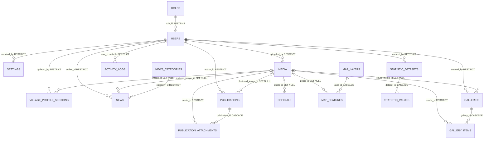

# ERD Final CMS Desa Sukomulyo

Dokumen ini menjadi sumber utama rancangan basis data CMS Desa Sukomulyo. Target basis data adalah MySQL/MariaDB dengan Laravel 12. Definisi migration harus mengikuti nullability, foreign key, aksi penghapusan, unique constraint, dan index dalam dokumen ini.

## Konvensi

- Primary key domain menggunakan `BIGINT UNSIGNED AUTO_INCREMENT` (`$table->id()`).
- Seluruh foreign key menggunakan `BIGINT UNSIGNED` dan otomatis memiliki index.
- `NN` berarti `NOT NULL`; `NULL` berarti nilai boleh kosong.
- Seluruh tabel domain memakai `created_at` dan `updated_at` yang `NN`, kecuali `activity_logs` yang hanya mempunyai `created_at`.
- Status, tipe, kategori, dan jenis visualisasi disimpan sebagai `VARCHAR` serta divalidasi melalui PHP enum dan Form Request.
- Slug tetap unique ketika record mengalami soft delete. Slug lama tidak dapat digunakan kembali.
- Akun admin tidak dihapus atau di-soft-delete. Penonaktifan dilakukan melalui `users.is_active`.
- `CASCADE` hanya dipakai untuk record anak yang tidak bermakna tanpa induknya; `SET NULL` untuk media opsional; `RESTRICT` untuk histori, pemilik konten, kategori, role, dan media yang masih digunakan.

## Diagram relasi domain

`contact_messages`, `idm_scores`, dan `redirects` tidak memiliki foreign key. Referensi polimorfik `activity_logs.record_type` + `record_id` sengaja tidak memakai foreign key database.

## Kamus tabel domain

### Akses dan pengguna

#### `roles`

| Kolom | Tipe | Null | Keterangan |
|---|---|---:|---|
| id | BIGINT UNSIGNED | NN | Primary key |
| name | VARCHAR(100) | NN | Nama tampilan role |
| code | VARCHAR(50) | NN | `super_admin`, `admin_konten`, atau `admin_data` |
| created_at | TIMESTAMP | NN | Laravel timestamp |
| updated_at | TIMESTAMP | NN | Laravel timestamp |

Constraint: `UNIQUE(name)`, `UNIQUE(code)`.

#### `users`

| Kolom | Tipe | Null | Keterangan |
|---|---|---:|---|
| id | BIGINT UNSIGNED | NN | Primary key |
| role_id | BIGINT UNSIGNED | NN | FK ke `roles.id` |
| name | VARCHAR(255) | NN | Nama admin |
| email | VARCHAR(255) | NN | Identitas login |
| email_verified_at | TIMESTAMP | NULL | Kompatibilitas autentikasi Laravel |
| password | VARCHAR(255) | NN | Hash password |
| is_active | BOOLEAN | NN | Default `true` |
| last_login_at | TIMESTAMP | NULL | Login sukses terakhir |
| remember_token | VARCHAR(100) | NULL | Token remember-me Laravel |
| created_at | TIMESTAMP | NN | Laravel timestamp |
| updated_at | TIMESTAMP | NN | Laravel timestamp |

Constraint: `UNIQUE(email)`; FK `role_id → roles.id ON DELETE RESTRICT`.

### Pengaturan dan profil desa

#### `settings`

| Kolom | Tipe | Null | Keterangan |
|---|---|---:|---|
| id | BIGINT UNSIGNED | NN | Primary key |
| key | VARCHAR(100) | NN | Kunci konfigurasi |
| value | LONGTEXT | NULL | Nilai boleh kosong |
| type | VARCHAR(30) | NN | Default `string` |
| group | VARCHAR(50) | NN | Kelompok pengaturan |
| is_public | BOOLEAN | NN | Default `false` |
| updated_by | BIGINT UNSIGNED | NN | FK admin terakhir yang mengubah |
| created_at | TIMESTAMP | NN | Laravel timestamp |
| updated_at | TIMESTAMP | NN | Laravel timestamp |

Constraint: `UNIQUE(key)`; FK `updated_by → users.id ON DELETE RESTRICT`; index `group`, `is_public`.

#### `village_profile_sections`

| Kolom | Tipe | Null | Keterangan |
|---|---|---:|---|
| id | BIGINT UNSIGNED | NN | Primary key |
| section_key | VARCHAR(50) | NN | Kunci bagian profil |
| title | VARCHAR(255) | NN | Judul bagian |
| content | LONGTEXT | NN | Konten yang sudah disanitasi |
| image_id | BIGINT UNSIGNED | NULL | Gambar opsional |
| status | VARCHAR(20) | NN | Default `draft` |
| display_order | UNSIGNED INT | NN | Default `0` |
| seo_title | VARCHAR(255) | NULL | Judul SEO khusus |
| seo_description | VARCHAR(320) | NULL | Deskripsi SEO khusus |
| updated_by | BIGINT UNSIGNED | NN | Admin terakhir yang mengubah |
| created_at | TIMESTAMP | NN | Laravel timestamp |
| updated_at | TIMESTAMP | NN | Laravel timestamp |

Constraint: `UNIQUE(section_key)`; FK `image_id → media.id ON DELETE SET NULL`; FK `updated_by → users.id ON DELETE RESTRICT`; index `(status, display_order)`.

#### `officials`

| Kolom | Tipe | Null | Keterangan |
|---|---|---:|---|
| id | BIGINT UNSIGNED | NN | Primary key |
| name | VARCHAR(255) | NN | Nama perangkat desa |
| position | VARCHAR(255) | NN | Jabatan |
| photo_id | BIGINT UNSIGNED | NULL | Foto opsional |
| biography | TEXT | NULL | Biografi singkat |
| display_order | UNSIGNED INT | NN | Default `0` |
| is_active | BOOLEAN | NN | Default `true` |
| created_at | TIMESTAMP | NN | Laravel timestamp |
| updated_at | TIMESTAMP | NN | Laravel timestamp |

FK `photo_id → media.id ON DELETE SET NULL`; index `(is_active, display_order)`.

### Media

#### `media`

| Kolom | Tipe | Null | Keterangan |
|---|---|---:|---|
| id | BIGINT UNSIGNED | NN | Primary key |
| original_name | VARCHAR(255) | NN | Nama file dari pengguna |
| stored_name | VARCHAR(255) | NN | Nama file pada storage |
| disk | VARCHAR(50) | NN | Default `public` |
| storage_path | VARCHAR(500) | NN | Path relatif dalam disk |
| mime_type | VARCHAR(100) | NN | MIME hasil inspeksi server |
| extension | VARCHAR(20) | NN | Ekstensi hasil validasi |
| file_size | BIGINT UNSIGNED | NN | Ukuran byte |
| width | UNSIGNED INT | NULL | Lebar gambar; null untuk non-gambar |
| height | UNSIGNED INT | NULL | Tinggi gambar; null untuk non-gambar |
| alt_text | VARCHAR(255) | NULL | Teks alternatif |
| caption | TEXT | NULL | Keterangan media |
| uploaded_by | BIGINT UNSIGNED | NN | Admin pengunggah |
| created_at | TIMESTAMP | NN | Laravel timestamp |
| updated_at | TIMESTAMP | NN | Laravel timestamp |
| deleted_at | TIMESTAMP | NULL | Soft delete |

Constraint: `UNIQUE(disk, storage_path)`; FK `uploaded_by → users.id ON DELETE RESTRICT`; index `mime_type`, `deleted_at`, `original_name`.

### Berita

#### `news_categories`

| Kolom | Tipe | Null | Keterangan |
|---|---|---:|---|
| id | BIGINT UNSIGNED | NN | Primary key |
| name | VARCHAR(100) | NN | Nama kategori |
| slug | VARCHAR(160) | NN | Slug URL |
| description | TEXT | NULL | Deskripsi kategori |
| created_at | TIMESTAMP | NN | Laravel timestamp |
| updated_at | TIMESTAMP | NN | Laravel timestamp |

Constraint: `UNIQUE(name)`, `UNIQUE(slug)`.

#### `news`

| Kolom | Tipe | Null | Keterangan |
|---|---|---:|---|
| id | BIGINT UNSIGNED | NN | Primary key |
| category_id | BIGINT UNSIGNED | NN | Kategori berita |
| title | VARCHAR(255) | NN | Judul berita |
| slug | VARCHAR(255) | NN | Slug URL permanen |
| excerpt | TEXT | NULL | Ringkasan |
| content | LONGTEXT | NN | Isi yang sudah disanitasi |
| featured_image_id | BIGINT UNSIGNED | NULL | Gambar utama opsional |
| status | VARCHAR(20) | NN | Default `draft` |
| published_at | TIMESTAMP | NULL | Waktu publikasi |
| author_id | BIGINT UNSIGNED | NN | Penulis/admin |
| seo_title | VARCHAR(255) | NULL | Judul SEO khusus |
| seo_description | VARCHAR(320) | NULL | Deskripsi SEO khusus |
| created_at | TIMESTAMP | NN | Laravel timestamp |
| updated_at | TIMESTAMP | NN | Laravel timestamp |
| deleted_at | TIMESTAMP | NULL | Soft delete |

Constraint: `UNIQUE(slug)`; FK `category_id → news_categories.id ON DELETE RESTRICT`; FK `featured_image_id → media.id ON DELETE SET NULL`; FK `author_id → users.id ON DELETE RESTRICT`; index `category_id`, `author_id`, `published_at`, `deleted_at`, dan composite `(status, published_at)`.

### Informasi publik

#### `publications`

| Kolom | Tipe | Null | Keterangan |
|---|---|---:|---|
| id | BIGINT UNSIGNED | NN | Primary key |
| type | VARCHAR(50) | NN | Jenis publikasi |
| title | VARCHAR(255) | NN | Judul |
| slug | VARCHAR(255) | NN | Slug URL permanen |
| excerpt | TEXT | NULL | Ringkasan |
| content | LONGTEXT | NN | Isi yang sudah disanitasi |
| featured_image_id | BIGINT UNSIGNED | NULL | Gambar utama opsional |
| start_date | DATE | NULL | Awal agenda/periode |
| end_date | DATE | NULL | Akhir agenda/periode |
| published_at | TIMESTAMP | NULL | Waktu publikasi |
| status | VARCHAR(20) | NN | Default `draft` |
| author_id | BIGINT UNSIGNED | NN | Penulis/admin |
| seo_title | VARCHAR(255) | NULL | Judul SEO khusus |
| seo_description | VARCHAR(320) | NULL | Deskripsi SEO khusus |
| created_at | TIMESTAMP | NN | Laravel timestamp |
| updated_at | TIMESTAMP | NN | Laravel timestamp |
| deleted_at | TIMESTAMP | NULL | Soft delete |

Constraint: `UNIQUE(slug)`; FK `featured_image_id → media.id ON DELETE SET NULL`; FK `author_id → users.id ON DELETE RESTRICT`; index `type`, `author_id`, `deleted_at`, dan composite `(status, published_at)`, `(type, status, published_at)`.

#### `publication_attachments`

| Kolom | Tipe | Null | Keterangan |
|---|---|---:|---|
| id | BIGINT UNSIGNED | NN | Primary key |
| publication_id | BIGINT UNSIGNED | NN | Induk publikasi |
| media_id | BIGINT UNSIGNED | NN | File lampiran |
| title | VARCHAR(255) | NULL | Nama tampilan lampiran |
| display_order | UNSIGNED INT | NN | Default `0` |
| created_at | TIMESTAMP | NN | Laravel timestamp |
| updated_at | TIMESTAMP | NN | Laravel timestamp |

Constraint: `UNIQUE(publication_id, media_id)`; FK `publication_id → publications.id ON DELETE CASCADE`; FK `media_id → media.id ON DELETE RESTRICT`; index `(publication_id, display_order)`.

### Statistik

#### `statistic_datasets`

| Kolom | Tipe | Null | Keterangan |
|---|---|---:|---|
| id | BIGINT UNSIGNED | NN | Primary key |
| category | VARCHAR(50) | NN | Kategori dataset |
| title | VARCHAR(255) | NN | Judul dataset |
| slug | VARCHAR(255) | NN | Slug URL |
| description | TEXT | NULL | Penjelasan |
| year | YEAR | NN | Tahun data |
| unit | VARCHAR(50) | NN | Satuan nilai |
| visualization_type | VARCHAR(30) | NN | Jenis visualisasi |
| source | VARCHAR(255) | NULL | Sumber data |
| status | VARCHAR(20) | NN | Default `draft` |
| display_order | UNSIGNED INT | NN | Default `0` |
| created_by | BIGINT UNSIGNED | NN | Admin pembuat |
| seo_title | VARCHAR(255) | NULL | Judul SEO khusus |
| seo_description | VARCHAR(320) | NULL | Deskripsi SEO khusus |
| created_at | TIMESTAMP | NN | Laravel timestamp |
| updated_at | TIMESTAMP | NN | Laravel timestamp |

Constraint: `UNIQUE(slug)`; FK `created_by → users.id ON DELETE RESTRICT`; index `(category, year)`, `(status, display_order)`, dan `created_by`.

#### `statistic_values`

| Kolom | Tipe | Null | Keterangan |
|---|---|---:|---|
| id | BIGINT UNSIGNED | NN | Primary key |
| dataset_id | BIGINT UNSIGNED | NN | Induk dataset |
| label | VARCHAR(255) | NN | Label nilai |
| value | DECIMAL(20,4) | NN | Nilai utama |
| secondary_value | DECIMAL(20,4) | NULL | Nilai tambahan |
| display_order | UNSIGNED INT | NN | Default `0` |
| metadata_json | JSON | NULL | Metadata visualisasi |
| created_at | TIMESTAMP | NN | Laravel timestamp |
| updated_at | TIMESTAMP | NN | Laravel timestamp |

Constraint: `UNIQUE(dataset_id, label)`; FK `dataset_id → statistic_datasets.id ON DELETE CASCADE`; index `(dataset_id, display_order)`.

#### `idm_scores`

| Kolom | Tipe | Null | Keterangan |
|---|---|---:|---|
| id | BIGINT UNSIGNED | NN | Primary key |
| year | YEAR | NN | Tahun IDM |
| idm_score | DECIMAL(8,4) | NN | Nilai IDM |
| iks_score | DECIMAL(8,4) | NN | Indeks ketahanan sosial |
| ike_score | DECIMAL(8,4) | NN | Indeks ketahanan ekonomi |
| ikl_score | DECIMAL(8,4) | NN | Indeks ketahanan lingkungan |
| status_label | VARCHAR(100) | NN | Status IDM |
| source | VARCHAR(255) | NULL | Sumber data |
| created_at | TIMESTAMP | NN | Laravel timestamp |
| updated_at | TIMESTAMP | NN | Laravel timestamp |

Constraint: `UNIQUE(year)`.

### Peta desa

#### `map_layers`

| Kolom | Tipe | Null | Keterangan |
|---|---|---:|---|
| id | BIGINT UNSIGNED | NN | Primary key |
| name | VARCHAR(255) | NN | Nama layer |
| slug | VARCHAR(255) | NN | Slug layer |
| description | TEXT | NULL | Deskripsi |
| geometry_type | VARCHAR(30) | NN | Jenis geometri yang diizinkan |
| style_json | JSON | NULL | Gaya Leaflet |
| display_order | UNSIGNED INT | NN | Default `0` |
| is_visible | BOOLEAN | NN | Default `true` |
| created_at | TIMESTAMP | NN | Laravel timestamp |
| updated_at | TIMESTAMP | NN | Laravel timestamp |

Constraint: `UNIQUE(slug)`; index `(is_visible, display_order)`.

#### `map_features`

| Kolom | Tipe | Null | Keterangan |
|---|---|---:|---|
| id | BIGINT UNSIGNED | NN | Primary key |
| layer_id | BIGINT UNSIGNED | NN | Induk layer |
| name | VARCHAR(255) | NN | Nama feature |
| description | TEXT | NULL | Deskripsi |
| geometry_json | JSON | NN | GeoJSON tervalidasi |
| latitude | DECIMAL(10,7) | NULL | Titik lintang opsional |
| longitude | DECIMAL(10,7) | NULL | Titik bujur opsional |
| photo_id | BIGINT UNSIGNED | NULL | Foto opsional |
| properties_json | JSON | NULL | Properti nonpribadi |
| is_visible | BOOLEAN | NN | Default `true` |
| created_at | TIMESTAMP | NN | Laravel timestamp |
| updated_at | TIMESTAMP | NN | Laravel timestamp |

FK `layer_id → map_layers.id ON DELETE CASCADE`; FK `photo_id → media.id ON DELETE SET NULL`; index `(layer_id, is_visible)` dan `(latitude, longitude)`.

### Galeri

#### `galleries`

| Kolom | Tipe | Null | Keterangan |
|---|---|---:|---|
| id | BIGINT UNSIGNED | NN | Primary key |
| title | VARCHAR(255) | NN | Judul galeri |
| slug | VARCHAR(255) | NN | Slug URL permanen |
| description | TEXT | NULL | Deskripsi |
| event_date | DATE | NULL | Tanggal kegiatan |
| cover_media_id | BIGINT UNSIGNED | NULL | Sampul opsional |
| status | VARCHAR(20) | NN | Default `draft` |
| created_by | BIGINT UNSIGNED | NN | Admin pembuat |
| seo_title | VARCHAR(255) | NULL | Judul SEO khusus |
| seo_description | VARCHAR(320) | NULL | Deskripsi SEO khusus |
| created_at | TIMESTAMP | NN | Laravel timestamp |
| updated_at | TIMESTAMP | NN | Laravel timestamp |
| deleted_at | TIMESTAMP | NULL | Soft delete |

Constraint: `UNIQUE(slug)`; FK `cover_media_id → media.id ON DELETE SET NULL`; FK `created_by → users.id ON DELETE RESTRICT`; index `(status, event_date)`, `created_by`, dan `deleted_at`.

#### `gallery_items`

| Kolom | Tipe | Null | Keterangan |
|---|---|---:|---|
| id | BIGINT UNSIGNED | NN | Primary key |
| gallery_id | BIGINT UNSIGNED | NN | Induk galeri |
| media_id | BIGINT UNSIGNED | NN | Media galeri |
| caption | TEXT | NULL | Keterangan item |
| display_order | UNSIGNED INT | NN | Default `0` |
| created_at | TIMESTAMP | NN | Laravel timestamp |
| updated_at | TIMESTAMP | NN | Laravel timestamp |

Constraint: `UNIQUE(gallery_id, media_id)`; FK `gallery_id → galleries.id ON DELETE CASCADE`; FK `media_id → media.id ON DELETE RESTRICT`; index `(gallery_id, display_order)`.

### Kontak, audit, dan SEO

#### `contact_messages`

| Kolom | Tipe | Null | Keterangan |
|---|---|---:|---|
| id | BIGINT UNSIGNED | NN | Primary key |
| name | VARCHAR(100) | NN | Nama pengirim |
| email | VARCHAR(150) | NN | Email pengirim |
| phone | VARCHAR(25) | NULL | Nomor telepon opsional |
| message | TEXT | NN | Pesan |
| created_at | TIMESTAMP | NN | Laravel timestamp |
| updated_at | TIMESTAMP | NN | Laravel timestamp |

Tidak memiliki foreign key, ticket, status, maupun data identitas kependudukan. Index `created_at` dan `email` untuk pencarian admin.

#### `activity_logs`

| Kolom | Tipe | Null | Keterangan |
|---|---|---:|---|
| id | BIGINT UNSIGNED | NN | Primary key |
| user_id | BIGINT UNSIGNED | NULL | Null untuk login gagal/proses sistem |
| action | VARCHAR(100) | NN | Kode aktivitas |
| module | VARCHAR(100) | NN | Modul sumber |
| record_type | VARCHAR(255) | NULL | Nama class model target |
| record_id | BIGINT UNSIGNED | NULL | ID target; sengaja tanpa FK |
| description | TEXT | NULL | Ringkasan aman |
| old_values_json | JSON | NULL | Nilai lama tanpa data rahasia |
| new_values_json | JSON | NULL | Nilai baru tanpa data rahasia |
| ip_address | VARCHAR(45) | NULL | IPv4/IPv6 |
| user_agent | TEXT | NULL | User agent |
| created_at | TIMESTAMP | NN | Waktu aktivitas |

FK `user_id → users.id ON DELETE RESTRICT`; index `user_id`, `action`, `(module, created_at)`, `(record_type, record_id)`, dan `created_at`.

#### `redirects`

| Kolom | Tipe | Null | Keterangan |
|---|---|---:|---|
| id | BIGINT UNSIGNED | NN | Primary key |
| old_path | VARCHAR(500) | NN | Path lama tanpa domain |
| new_path | VARCHAR(500) | NN | Path tujuan tanpa domain |
| status_code | SMALLINT UNSIGNED | NN | Default `301` |
| created_at | TIMESTAMP | NN | Laravel timestamp |
| updated_at | TIMESTAMP | NN | Laravel timestamp |

Constraint: `UNIQUE(old_path)`; index `new_path`.

## Foreign key dan aksi penghapusan

| Tabel.kolom | Referensi | Nullable | ON DELETE |
|---|---|---:|---|
| users.role_id | roles.id | Tidak | RESTRICT |
| settings.updated_by | users.id | Tidak | RESTRICT |
| village_profile_sections.image_id | media.id | Ya | SET NULL |
| village_profile_sections.updated_by | users.id | Tidak | RESTRICT |
| officials.photo_id | media.id | Ya | SET NULL |
| media.uploaded_by | users.id | Tidak | RESTRICT |
| news.category_id | news_categories.id | Tidak | RESTRICT |
| news.featured_image_id | media.id | Ya | SET NULL |
| news.author_id | users.id | Tidak | RESTRICT |
| publications.featured_image_id | media.id | Ya | SET NULL |
| publications.author_id | users.id | Tidak | RESTRICT |
| publication_attachments.publication_id | publications.id | Tidak | CASCADE |
| publication_attachments.media_id | media.id | Tidak | RESTRICT |
| statistic_datasets.created_by | users.id | Tidak | RESTRICT |
| statistic_values.dataset_id | statistic_datasets.id | Tidak | CASCADE |
| map_features.layer_id | map_layers.id | Tidak | CASCADE |
| map_features.photo_id | media.id | Ya | SET NULL |
| galleries.cover_media_id | media.id | Ya | SET NULL |
| galleries.created_by | users.id | Tidak | RESTRICT |
| gallery_items.gallery_id | galleries.id | Tidak | CASCADE |
| gallery_items.media_id | media.id | Tidak | RESTRICT |
| activity_logs.user_id | users.id | Ya | RESTRICT |
| sessions.user_id | users.id | Ya | CASCADE |

## Tabel infrastruktur Laravel

Tabel berikut mengikuti migration bawaan Laravel 12 dan dipisahkan dari domain:

- `password_reset_tokens`: `email` sebagai primary key, `token`, dan `created_at` nullable. Tidak memakai FK agar reset tetap independen dari perubahan akun.
- `sessions`: `id` primary key; `user_id` nullable dan berindex dengan FK ke `users.id ON DELETE CASCADE`; `ip_address` dan `user_agent` nullable; `payload` serta `last_activity` wajib.
- `cache` dan `cache_locks`: skema bawaan database cache Laravel.
- `jobs`, `job_batches`, dan `failed_jobs`: tetap dipertahankan untuk kompatibilitas, meskipun MVP memakai `QUEUE_CONNECTION=sync`. `failed_jobs.uuid` tetap unique.

## Daftar unique constraint

| Tabel | Constraint unique |
|---|---|
| roles | `name`, `code` |
| users | `email` |
| settings | `key` |
| village_profile_sections | `section_key` |
| media | `(disk, storage_path)` |
| news_categories | `name`, `slug` |
| news | `slug` |
| publications | `slug` |
| publication_attachments | `(publication_id, media_id)` |
| statistic_datasets | `slug` |
| statistic_values | `(dataset_id, label)` |
| idm_scores | `year` |
| map_layers | `slug` |
| galleries | `slug` |
| gallery_items | `(gallery_id, media_id)` |
| redirects | `old_path` |
| failed_jobs | `uuid` |

## Urutan migration yang aman

Urutan ini menghindari referensi ke tabel yang belum dibuat:

1. `roles`
2. `users`, `password_reset_tokens`, dan `sessions`
3. `cache`, `cache_locks`, `jobs`, `job_batches`, dan `failed_jobs`
4. `media`
5. `settings`, `village_profile_sections`, dan `officials`
6. `news_categories` lalu `news`
7. `publications` lalu `publication_attachments`
8. `statistic_datasets` lalu `statistic_values`, kemudian `idm_scores`
9. `map_layers` lalu `map_features`
10. `galleries` lalu `gallery_items`
11. `contact_messages`, `activity_logs`, dan `redirects`

Urutan rollback adalah kebalikan urutan tersebut. Karena user dan media dipertahankan untuk histori, penghapusan permanen hanya boleh dilakukan setelah seluruh referensi yang memakai `RESTRICT` diselesaikan secara eksplisit.

## Perbedaan terhadap migration saat ini

Implementasi database yang ada belum sepenuhnya sesuai dengan ERD ini. Migration berikut diperlukan pada tahap implementasi, tetapi tidak dibuat oleh dokumen ini:

- Tambahkan `roles`, lalu tambahkan `role_id`, `is_active`, dan `last_login_at` pada `users`.
- Ubah `sessions.user_id` menjadi foreign key nullable dengan `ON DELETE CASCADE`; migration saat ini hanya membuat index.
- Pertahankan struktur inti `contact_messages`, lalu tambahkan index `created_at` dan `email`.
- Buat seluruh tabel domain lain sesuai urutan migration di atas.
- Gunakan MySQL/MariaDB pada development integration test untuk memverifikasi kolom JSON, YEAR, panjang index, dan aksi foreign key; SQLite tetap boleh dipakai untuk unit test yang tidak menguji perilaku khusus database.

## Checklist validasi implementasi

- Setiap kolom berakhiran `_id` memiliki FK, kecuali `activity_logs.record_id` yang merupakan referensi polimorfik terdokumentasi.
- Setiap FK nullable hanya memakai `SET NULL` bila parent boleh dihapus; seluruh FK wajib memakai `RESTRICT` atau `CASCADE` sesuai tabel di atas.
- Semua constraint unique tetap berlaku pada record soft-deleted.
- Penghapusan permanen media ditolak selama masih digunakan oleh attachment atau item galeri, termasuk parent yang soft-deleted.
- Penghapusan role ditolak selama masih digunakan user; user tidak menyediakan operasi delete.
- Mermaid di bagian diagram dapat dirender oleh renderer Mermaid yang mendukung `erDiagram`.
- Fresh migration dan rollback dijalankan pada MySQL/MariaDB, lalu diverifikasi menggunakan test foreign key, unique constraint, nullability, dan soft-delete slug.
